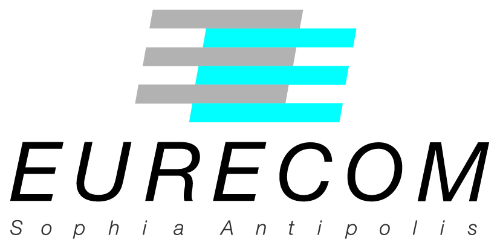
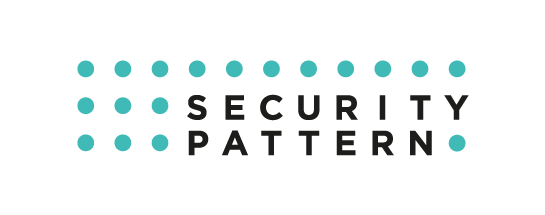
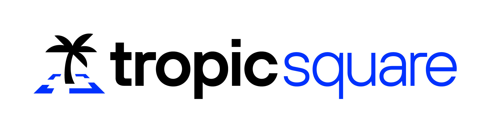

# ORSHIN: Open-source ReSilient Hardware and software for Internet of thiNgs
How to design embedded and connected devices taking advantage of open source hardware (and software) 

# About
It is common wisdom that cyber security is only as strong as the weakest link in a chain. Therefore, the main challenge is to identify the critical points of IoT infrastructure. To address this issue, ORSHIN is creating the first generic and integrated methodology, called trusted lifecycle, to develop secure network devices based on open-source components while managing their entire lifecycle. ORSHIN's trustworthy lifecycle consists of different phases (design, implementation, evaluation, installation, maintenance and retirement) that form a chain of trust. This lifecycle defines how the safety objectives are translated into policies for defined phases. Using this holistic view, ORSHIN will address critical links, reduce threats and improve security of open-source devices. 

# Vision
The open-source initiative represents a significant shift in the industry, providing the opportunity to share knowledge between industry and research and enabling rapid time-to-market for solutions, but there is still much room for improvement - particularly with a view to cyber security. Therefore, the ORSHIN project team will step together and develop a new approach that will improve cyber security, manage the entire lifecycle of trustworthy network and create a secure infrastructure for connected devices. To meet this challenge ORSHIN will work on building a trusted open-source hardware and software that will significantly reduce the risks associated with IoT devices - from design to its retirement, as a chain of trust called the trusted lifecycle. 

# Repositories

| ORSHIN Repository | Partner Repository | Notes and Description |
| ------------- | ------------- | ------------- |
| [Demo Platform](https://github.com/ORSHIN/demo)                                                      | Tropic Square                                                                          | The ORSHIN demonstrator platfrom. |
| [ORSHIN Public Assets](https://github.com/ORSHIN/public-assets)                                      | Tropic Square                                                                          | Summary of project results and their applicability. |
| [ADF](https://github.com/ORSHIN/tropic-adf) (Demo Extension)                                         | [EURECOM](https://github.com/francozappa/adf)                                          | A threat modeling framework for IoT devices. Note: the [tropic-adf](https://github.com/ORSHIN/tropic-adf) fork improves ADF usability and interconnects ADF with the [MITRE EMB3D™](https://emb3d.mitre.org/). |
| [Proteus](https://github.com/ORSHIN/proteus-core_proteus)                                            | [KU Leuven](https://github.com/proteus-core/proteus/)                                  | Proteus is an extensible RISC-V CPU with an in-order and an out-of-order pipeline, designed to accelerate security research. |
| [Proteus/ProSpeCT](https://github.com/ORSHIN/proteus-core_prospect)                                  | [KU Leuven](https://github.com/proteus-core/prospect)                                  | The design of the Proteus extension for "ProSpeCT: Provably Secure Speculation for the Constant-Time Policy". |
| [Proteus/AMi](https://github.com/ORSHIN/proteus-core_ami)                                            | [KU Leuven](https://github.com/proteus-core/ami)                                       | The design of the Proteus extension for "Architectural Mimicry: Innovative Instructions to Efficiently Address Control-Flow Leakage in Data-Oblivious Programs".  |
| [Proteus/Libra](https://github.com/ORSHIN/proteus-core_libra)                                        | [KU Leuven](https://github.com/proteus-core/libra)                                     | The design of the Proteus extension for "Libra: Architectural Support For Principled, Secure And Efficient Balanced Execution On High-End Processors".  |
| [Time Sharing Masking (TSM)](https://github.com/ORSHIN/KULeuven-COSIC_TSM/tree/main/TSM)             | [KU Leuven](https://github.com/KULeuven-COSIC/TSM/tree/main/TSM)                       | Low-latency masking for hardware implementations of cryptographic algorithms. |
| [Pre-silicon Security Testing](https://github.com/ORSHIN/orshinAtNXP_deliverable_4_2)                | [NXP](https://github.com/orshinAtNXP/deliverable_4_2)                                  | Collection of artifacts necessary for reproduction of pre-silicon security testing demonstrator. |
| [OpenOCD](https://github.com/ORSHIN/NXP-Horizon-Orshin_OpenOCD)                                      | [NXP](https://github.com/NXP-Horizon-Orshin/OpenOCD)                                   | OpenOCD with integrated Teensy support. |
| [RV-Qspi-Dbg](https://github.com/ORSHIN/NXP-Horizon-Orshin_RV-Qspi-Dbg)                              | [NXP](https://github.com/NXP-Horizon-Orshin/RV-Qspi-Dbg)                               | Python Teensy driver. |
| [Dbg-Templates](https://github.com/ORSHIN/NXP-Horizon-Orshin_Dbg-Templates)                          | [NXP](https://github.com/NXP-Horizon-Orshin/Dbg-Templates)                             | Debug templates for the Teensy debugger, and modified Core-V-MCU. |
| [Fault-Injection-Framework](https://github.com/ORSHIN/NXP-Horizon-Orshin_Fault-Injection-Framework)  | [NXP](https://github.com/NXP-Horizon-Orshin/Fault-Injection-Framework)                 | Fault injection testing framework. |
| [Embedded-Testing-Framework](https://github.com/ORSHIN/NXP-Horizon-Orshin_Embedded-Testing-Framework)| [NXP](https://github.com/NXP-Horizon-Orshin/Embedded-Testing-Framework)                | Hybrid fuzzing framework. |
| [Test-Firmware-Core-V](https://github.com/ORSHIN/NXP-Horizon-Orshin_Test-Firmware-Core-V)            | [NXP](https://github.com/NXP-Horizon-Orshin/Test-Firmware-Core-V)                      | Core-V-MCU test firmware. |
| [BB-protocols](https://github.com/ORSHIN/bb-sec-protocols)                                           | [EURECOM](https://github.com/sacca97/bb-sec-protocols)                                 | Two novel protocols replacing the standard Bluetooth pairing and session establishment. |
| [E-Spoofer](https://github.com/ORSHIN/Skiti_ESpoofer)                                                | [EURECOM](https://github.com/Skiti/ESpoofer)                                           | E-Spoofer is a toolkit that reverse-engineers the Xiaomi proprietary application-layer protocols spoken over BLE, and attacks Xiaomi electric scooters (M365, Pro 1, Pro 2, 1S, Essential, Mi 3) and the Mi Home app. |
| [CTRAPS toolkit](https://github.com/ORSHIN/Skiti_CTrAPs)                                             | [EURECOM](https://github.com/Skiti/CTrAPs)                                             | This repository contains the CTRAPS toolkit related to the paper titled: CTRAPS: CTAP Client Impersonation and API Confusion on FIDO2. |
| [BLUFFS Attack and Defenses](https://github.com/ORSHIN/francozappa_bluffs)                           | [EURECOM](https://github.com/francozappa/bluffs)                                       | This repository contains code related to the paper titled: BLUFFS: Bluetooth Forward and Future Secrecy Attacks and Defenses. |
| [SCP03/NSCP RPi](https://github.com/ORSHIN/orshin-rpi_scp03) (Demo Extension)                        | [Security Pattern](https://github.com/securitypattern/orshin-rpi_scp03)                | Code of a slightly modified nano-package library, used to program a master device. |
| [SCP03/NSCP Core-V](https://github.com/ORSHIN/orshin-corev-secure-element) (Demo Extension)          | [Security Pattern](https://github.com/securitypattern/orshin-corev-secure-element)     | Command-Line-Interface test routines for the CORE-V MCU. |
| [SCP03/NSCP STM32](https://github.com/ORSHIN/orshin-STM32-client-scp03-nscp)                         | [Security Pattern](https://github.com/securitypattern/orshin-STM32-client-scp03-nscp)  | Code used to implement the Secure Channel Protocol 03 (SCP03) in the context of a system composed of a RaspberryPi (acting as a master device/host) and an STM32 Nucleo board (acting as a slave device/secure element). |
| [SCA with VoLPE](https://github.com/ORSHIN/orshin-VoLPE)                                             | [Security Pattern](https://github.com/securitypattern/orshin-VoLPE)                    | The tool called VoLPE, designed to quantify the power consumption leakage of a circuit by analyzing the toggle activity observed during its simulation. |
| [SCA of of Ascon](https://github.com/ORSHIN/orshin-ascon-analysis)                                   | [Security Pattern](https://github.com/securitypattern/orshin-ascon-analysis)           | Code that allows the deployment of selected Ascon algorithm implementations on an FPGA, the acquisition of power traces using the ChipWhisperer Husky tool, and their subsequent analysis. |
| [SCA of TinyTapeout 02 Designs](https://github.com/ORSHIN/orshin-tiny-tapeout)                       | [Security Pattern](https://github.com/securitypattern/orshin-tiny-tapeout)             | Project that enables the acquisition and analysis of power traces using a Teledyne LeCroy oscilloscope connected to a TinyTapeout board. |

**Note:** All ORSHIN repositories are kept under the [ORSHIN](https://github.com/ORSHIN) GitHub organization, but some were originally created by the project partners in different locations. The original location is kept primary for traceability, while the [ORSHIN](https://github.com/ORSHIN) GitHub organization hosts repository forks with demonstrator-related changes, and for archival reasons.

# Partners

### Technikon Forschungs- und Planungsgesellschaft mbH, AUSTRIA
<table>
  <tr>
    <td width="200">
      
    </td>
    <td>
Technikon (TEC) is a private, independent, Austrian SME with a highly specialized multinational team of 20+ engineers and scientists. It is dedicated towards engineering services as well as the planning, assessment and coordination of large industry driven international research projects. TEC as a main coordinator of ORSHIN project will contribute to the definition of the security requirements and focus on the data management and risk assessment. With extensive and long-lasting expertise in project management, TEC will ensure achieving ambitious goals, monitor risk and ensuring that appropriate risk mitigation measures are applied to reach the project objectives. In addition, TEC’s innovative media team will make sure to properly communicate and disseminate the project progress and its results in diversified ways.
    </td>
  </tr>
</table>

### Katholieke Universiteit Leuven, BELGIUM
<table>
  <tr>
    <td width="200">
      
    </td>
    <td>
KU Leuven [in Belgium] is an international community where innovative research forms the basis of all our academic programmes. Within ORSHIN we will work closely with two groups of KU Leuven (KUL). The Computer Security and Industrial Cryptography (COSIC) team belongs to the electrical engineering department and has more than hundred members ranging from PhD students to experts and professors from nearly all over the world. The research of COSIC covers a broad range from mathematical foundations of cryptography over protocols and algorithms to secure and efficient implementation in hardware and software. The DistriNet group belongs to the computer science department and covers the area of software and system security, distributed systems, and software engineering. KUL will work on formal verification of security properties and in particular on the needed models. KUL is scientific leader of ORSHIN.
    </td>
  </tr>
</table>

### EURECOM, FRANCE
<table>
  <tr>
    <td width="200">
    
    </td>
    <td>
EURECOM´s (ECM) research and teaching institute is one of the most active technological parks in Europe. ECM represents one of the schools under the Institut Mines Telecom organization and is governed by an international consortium of industrial and academic partners. Besides teaching at the MSc and PhD levels, ECM activities mainly revolve around networking, data science, computer security, multimedia, and mobile communications research. Daniele Antonioli is the technical lead and responsible for the secure and privacy preserving communication research while Aurelien Francillon is role and manages the secure auditing and testing ones. They are also contributing to effective auditing techniques, definition of the trusted life cycle and help identify its security requirements for ORSHIN project.
    </td>
  </tr>
</table>

### NXP Semiconductors Germany GmbH, GERMANY
<table>
  <tr>
    <td width="200">
    
    </td>
    <td>
NXP (formerly Philips Semiconductors) is well-known semiconductors manufacturer, with more than 90 years of experience. As a privately held manufacturer headquartered in the Netherlands it operates in more than 33 countries worldwide. The Hamburg site hosts a significant part of the Security Organization within NXP, including the majority of the internal Vulnerability Analysis (VA) team, where expertise ranges from side channel analysis to fault injection and software vulnerabilities. NXP will be in charge of developing effective security audits of firmware programs and open hardware. Additionally, it will lead the activities on tool development for enhanced security testing for open-source chip designs and firmware and support identification of the requirements for software audit.
    </td>
  </tr>
</table>

### Security Pattern Srl, ITALY
<table>
  <tr>
    <td width="200">
    
    </td>
    <td>
Security Pattern (SEC) is an innovative start-up founded in Italy. With the core business in consultancy and development of innovative security solutions for embedded systems SEC presents a word-leading player in the domain. The two founders, Guido Bertoni and Filippo Melzani, have long experience in a multinational semiconductor company, performing R&D in the field of cryptography, secure communication protocols, implementation of cryptographic algorithms secure against side-channel and fault attacks. SEC has the expertise in the definition of security requirements, selection of building blocks, development of hardware and software components and provides development methodologies for customers who need to demonstrate a ‘secure by design’ approach. For ORSHIN, SEC will take the lead on developing trusted life cycle methodologies, support development of robust crypto blocks and contribute to secure communication for embedded devices.
    </td>
  </tr>
</table>

### Texplained, FRANCE
<table>
  <tr>
    <td width="200">
      
    </td>
    <td>
Texplained (TXP) is expert in microchips security that offers solutions to fight against hardware piracy and counterfeiting. The French company designs tools for IC security evaluation and represents an established cryptographic research community. With its unique expertise on real world attacks, and its disruptive and efficient methodology, TXP provides experience on chip security for various types of applications (Banking, e-Gov, IoT, Automotive, Medical, Consumer, etc.). In addition, TXP offers different types of services, such as secure IC architecture and IC risk assessment, design counselling, hardware backdoors research and pirate device analysis. For ORSHIN, TXP will provide a methodology for inspection and evaluation of the security of the open chip designs, identify vulnerabilities that can be exploited by hardware attacks and contribute to the definition of requirements from physical perspective of ORSHIN components.
    </td>
  </tr>
</table>

### Tropic Square s.r.o., CZECH REPUBLIC
<table>
  <tr>
    <td width="200">
      
    </td>
    <td>
Tropic Square (TRPC) is a privately held start-up from Czech Republic, known for providing transparent and secure chip solutions. The company is fully focused on designing a transparent and auditable silicon secure element chip, freely available on the market. As from 2021, the company secured funding for the development of the first generation of a device called TROPIC01. TRPC is forming as fabless design house focused on secure system level solutions and design consultancy in that area. For ORSHIN project TRPC will take over the main tasks for creating and delivering outcomes that are compliant with open-source standards and contribute with its experience with design and industry.
    </td>
  </tr>
</table>

# Acknowledgement
Funded by the European Union under grant agreement no. 101070008. Views and opinions expressed are however those of the author(s) only and do not necessarily reflect those of the European Union. Neither the European Union nor the granting authority can be held responsible for them.

